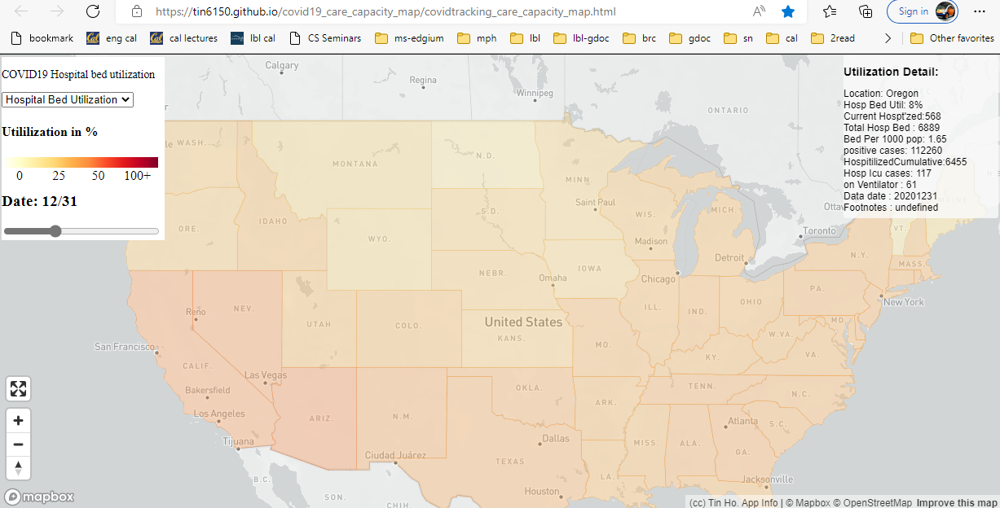

covid19_care_capacity_map
~~~~~~~~~~~~~~~~~~~~~~~~~

Hospital bed capacity by state vs covid19 cases  
May help present problem to those shrugging the COVID19 problem off? 
For now plan to display hospital bed and hospitalized patient count 
Ideally also get ICU bed count and usage.

URL: https://tin6150.github.io/covid19_care_capacity_map/

DATA SOURCES
============

* https://covidtracking.com/data  and  https://covidtracking.com/api for case count
* https://kff.org for Hospital bed capacity

Ref
===

* https://www.zdnet.com/article/data-scientists-white-house-issues-a-call-to-arms/
* https://pages.semanticscholar.org/coronavirus-research
 
* Example geoJSON: https://www.mapbox.com/help/data/stations.geojson
* Additional ref: https://www.mapbox.com/help/define-geojson/

ABOUT
=====

(cc) copyleft creative commons BY-SA.
Tin Ho [tin (at) berkeley.edu]

Special thanks to Mapbox for generously providing free tier usage for their map platform!

.. # use 8-space tab as that's how github render the rst
.. # vim: shiftwidth=8 tabstop=8 noexpandtab paste 
